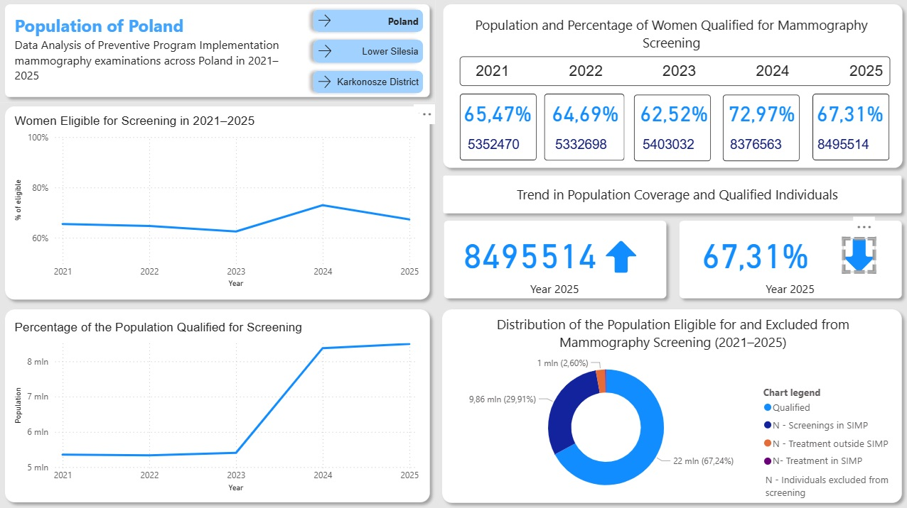

# powerBi-mini-project

## Data visualization of the Implementation of Preventive Programs – Mammography Examinations Across Poland in 2021–2025 

The report presents an analysis of patients covered by preventive mammography examinations as part of the breast cancer prevention program organized by the National Health Fund (NFZ). Within this preventive framework, the NFZ offers breast examinations to all women between the ages of 45 and 74. Accordingly, the population covered by this analysis includes women aged 45–74 who are insured under the National Health Fund. 
The data and results are presented in a .

1. The following analyses were conducted: 

  - Analysis of changes in the size of the population and the percentage of Poland population covered by the examination.
  - Analysis of changes in the size of the population and the percentage of the Lower Silesia population covered by the examination.
  - Analysis of changes in the size of the population and the percentage of the Karkonosze District population covered by the examination.  

2. Data:

   The analyzed data were obtained from the NFZ (National Health Fund) report “Data on the Implementation of Preventive Programs (Mammography, Cytology, Colonoscopy)”. The data show the number of people in each voivodeship, county, and commune who qualify for the examination, as well as those who do not qualify due to having undergone a mammography examination within the previous two years, those currently undergoing breast cancer treatment, or those within the five-year post-treatment monitoring period. 

  
4. Methodology:

   The analysis was carried out using Power BI and its built-in functions. The databases were initially processed in Microsoft Excel to extract the most relevant information. Subsequently, data analysis was performed using the DAX language. 
Data for the Karkonosze District are presented only for the period 2021–2025, as the county was established in 2021. 

 
5. Result:

   The population of women aged 45–74 is increasing across Poland. This trend is also observed on a smaller scale (in the Lower Silesia voivodeship and the Karkonosze District). The number of women eligible for screening increases along with the overall population size; however, the percentage of women qualified for the examination decreases in the last year, which may be due to preventive screenings conducted in previous years.

 
